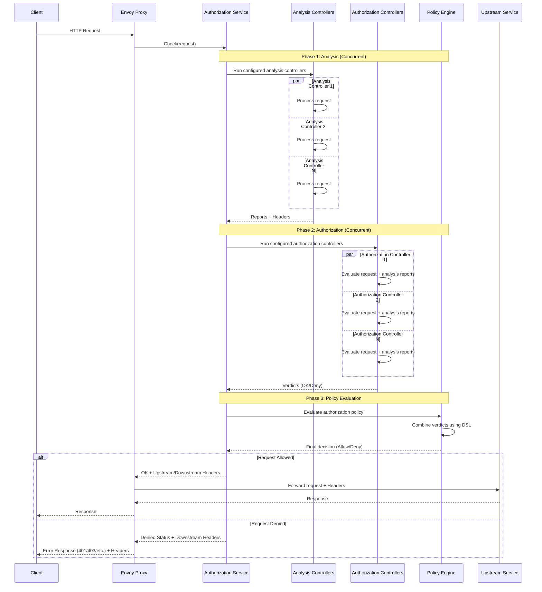

# Envoy Authorization Service

An authorization service that implements the [Envoy gRPC External Authorization API](https://www.envoyproxy.io/docs/envoy/latest/configuration/http/http_filters/ext_authz_filter).

Provides a flexible, policy-driven authorization framework with observability built-in.

## Overview

The Envoy Authorization Service enables access control policies for services behind Envoy Proxy through a two-phase pipeline:

1. **Analysis Phase**: Extract and enrich request metadata (e.g., GeoIP, ASN lookups)
2. **Authorization Phase**: Make allow/deny decisions based on configured controllers
3. **Policy Evaluation**: Combine authorization controllers'verdicts using boolean expressions

This architecture allows you to compose authorization logic like:
```
corporate-network || ip-whitelist
```

## Key Features

- **🚀 Production-Ready**: Graceful shutdown, health endpoints, structured logging, and Prometheus metrics
- **🔌 Extensible**: Extensible analysis and authorization controller system
- **📜 Policy DSL**: Express complex requirements with validated boolean expressions
- **🏷️ Header Injection**: Dynamically add headers to upstream/downstream requests
- **📊 Full Observability**: Prometheus metrics, structured logs (logfmt), health checks
- **⚡ High Performance**: Concurrent controller execution, caching, minimal latency
- **🛠️ Easy Configuration**: YAML-based configuration with validation and defaults

## Architecture

### Request Flow



### Controller Architecture

**Analysis Controllers** run first and produce metadata reports:
- Execute concurrently
- Cannot block requests directly
- Emit headers and structured data
- Results available to authorization controllers

**Authorization Controllers** make allow/deny decisions:
- Execute concurrently
- Return gRPC status codes (OK, PermissionDenied, etc.)
- Can reference analysis reports
- Verdicts combined via policy expression

**Policy DSL** evaluates boolean expressions:
- References authorization controller names
- Supports AND (`&&`), OR (`||`), NOT (`!`), and parentheses
- Validated at startup against configured controllers
- Identifies which controller caused denials

## Configuration

Configuration uses YAML with the following top-level sections.

> **Note:** relative paths are resolved from the current working directory

```yaml
logging:
  level: info # or debug, warn, error. Defaults to info if omitted

# gRPC server configuration
server:
  address: ":9001"

  # Optional
  tls:  
    certFile: certs/server.crt
    keyFile: certs/server.key

    # Optional. Mandatory if `requireClientCert` is true
    caFile: certs/ca.crt
    requireClientCert: true # defaults to false

# Metrics server configuration & health endpoints
metrics:
  address: ":9090"
  healthPath: /healthz
  readinessPath: /readyz

# Optional graceful shutdown configuration
shutdown:
  timeout: 25s # Defaults to 20s

# Analysis controllers
analysisControllers:
  - name: asn-detect # custom name, will appear in logs and metrics
    type: maxmind-asn # one of those provided by this project
    settings:
      databasePath: config/GeoLite2-ASN.mmdb
  
  - name: geoip-detect
    type: maxmind-geoip
    settings:
      databasePath: config/GeoLite2-City.mmdb

# Authorization controllers
authorizationControllers:
  - name: ip-blacklist # custom name, will appear in logs and metrics
    type: ip-match # one of those provided by this project
    settings:
      action: deny
      cidrList: config/ip-blacklist.txt
  
  - name: ip-whitelist
    type: ip-match
    settings:
      action: allow
      cidrList: config/ip-whitelist.txt
  
  - name: trusted-asns
    type: asn-match
    settings:
      action: allow
      asList: config/trusted-asns.txt

# Policy expression combining authorization controllers
authorizationPolicy: "(ip-whitelist || !ip-blacklist) && trusted-asns"

# Allow requests even when policy denies (for testing)
authorizationPolicyBypass: false # Defaults to false
```

### Validation

Configuration is validated at startup:
- Required fields checked
- File paths verified
- Controller types registered
- Policy expression parsed against controller names
- Duplicate controller names rejected

## Available Analysis Controllers

### MaxMind ASN ([`maxmind-asn`](./pkg/analysis/maxmind_asn/))

Performs IP-to-ASN lookups using MaxMind ASN database.

**Upstream provided headers**:
- `X-ASN-Number`
- `X-ASN-Organization`

**Example Configuration**:
```yaml
- name: asn-detect
  type: maxmind-asn
  settings:
    databasePath: config/GeoLite2-ASN.mmdb
```
---

### MaxMind GeoIP ([`maxmind-geoip`](./pkg/analysis/maxmind_geoip/))

Performs IP-to-location lookups using MaxMind City database.

**Upstream provided headers**:
- `X-GeoIP-City`
- `X-GeoIP-PostalCode`
- `X-GeoIP-Region`
- `X-GeoIP-Country`
- `X-GeoIP-CountryISO`
- `X-GeoIP-Continent`
- `X-GeoIP-TimeZone`
- `X-GeoIP-Latitude`
- `X-GeoIP-Longitude`

**Example Configuration**:
```yaml
- name: geoip-detect
  type: maxmind-geoip
  settings:
    databasePath: config/GeoLite2-City.mmdb
```
---

## Available Authorization Controllers

### IP Match ([`ip-match`]((./pkg/authorization/ip_match/)))

Allow or deny based on request IP match versus a list of IP/CIDR.

**Configuration**:
```yaml
# Allowlist mode (only permit listed IPs)
- name: corporate-ips
  type: ip-match
  settings:
    action: allow
    cidrList: config/corporate-cidrs.txt

# Denylist mode (block listed IPs)
- name: botnet
  type: ip-match
  settings:
    action: deny
    cidrList: config/botnet-cidrs.txt
```
---

### ASN Match ([`asn-match`](./pkg/authorization/asn_match/))

Allow or deny based on request IP belonging to a list of Autonomous System Numbers.

**Requires `maxmind-asn` analysis controller.**

**Configuration**:
```yaml
# Allowlist mode
- name: trusted-cloud-provider
  type: asn-match
  settings:
    action: allow
    asList: config/trusted-cloud-provider-asns.txt

# Denylist mode
- name: malicious-botnet
  type: asn-match
  settings:
    action: deny
    asList: config/malicious-botnet-asns.txt
```
---

### IP Match Database ([`ip-match-database`](./pkg/authorization/ip_match_database/))

Allow or deny based on IP address lookups in external databases (Redis or PostgreSQL).

Enables dynamic IP control based on behavioral analysis, threat intelligence, or partner management systems.

**Features**:
- Redis and PostgreSQL support
- Optional TTL-based caching
- Configurable fail-open/fail-closed behavior

**Configuration**:
```yaml
# Redis blocklist
- name: scraper
  type: ip-match-database
  settings:
    action: deny
    cache:
      ttl: 10m
    database:
      type: redis
      redis:
        keyPrefix: "scraper:"
        host: redis.example.com
        port: 6379

# PostgreSQL allowlist
- name: partner
  type: ip-match-database
  settings:
    action: allow
    cache:
      ttl: 15m
    database:
      type: postgres
      postgres:
        query: "SELECT 1 FROM trusted_ips WHERE ip = $1 LIMIT 1"
        host: postgres.example.com
        port: 5432
        databaseName: security
        usernameEnv: POSTGRES_USER
        passwordEnv: POSTGRES_PASSWORD
```

See the [detailed documentation](./pkg/authorization/ip_match_database/) for complete configuration options, TLS setup, and metrics.

---

## [Policy DSL](./pkg/policy/)

The policy DSL is a boolean expression language for combining authorization controller verdicts.

### Syntax

- **Controllers**: Reference by name (e.g., `ip-whitelist`)
- **AND**: `controller1 && controller2` (both must allow)
- **OR**: `controller1 || controller2` (either allows)
- **NOT**: `!controller` (invert result)
- **Grouping**: `(controller1 && controller2) || controller3`

### Evaluation

Each authorization controller returns a gRPC status code:
- `codes.OK` → Evaluates to `true` in policy
- Any other code → Evaluates to `false` in policy

### Validation

Policy is validated at startup:
- Syntax errors reported with position
- Unknown controller names rejected
- Empty policy defaults to "allow all"


## Utilities

### CIDR List Synthesis

Remove redundant CIDR entries:

```bash
# Create a new optimized list
envoy-authorization-service \
  synthesize-cidr-list \
  --file config/ip-blacklist.txt > config/ip-blacklist-optimized.txt

# Overwrite the list file with an optimized version
envoy-authorization-service \
  synthesize-cidr-list \
  --file config/ip-blacklist.txt \
  --overwrite
```

### ASN List Synthesis

Remove duplicate ASN entries:

```bash
# Create a new de-duplicated list
envoy-authorization-service \
  synthesize-asn-list \
  --file config/allowed-asns.txt > config/allowed-asns-optimized.txt

# Overwrite the list file with a de-suplicated version
envoy-authorization-service \
  synthesize-asn-list \
  --file config/allowed-asns.txt \
  --overwrite
```

## License

[MIT](./LICENSE)
