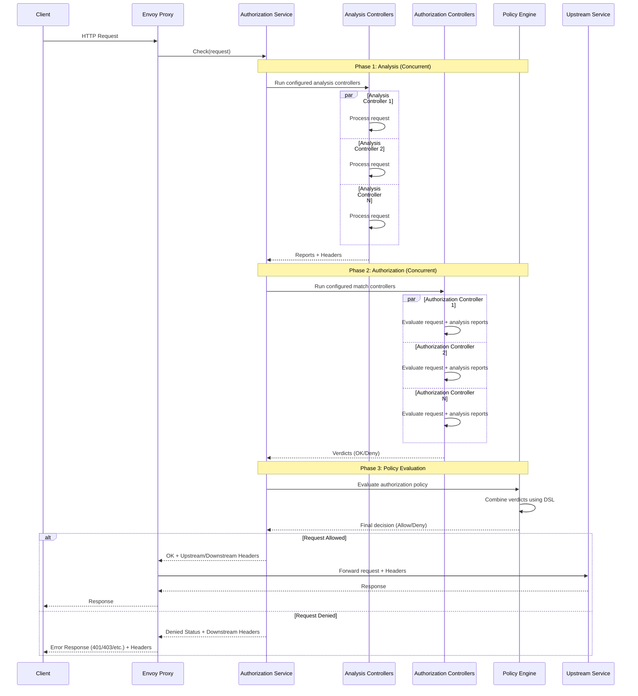

# Architecture

The Envoy Authorization Service provides a flexible, extensible framework for implementing access control policies through a three-phase pipeline.

## Request Processing Flow



## Analysis Phase

Extract and enrich request metadata without blocking the request.

**Characteristics**:
- All analysis **controllers run concurrently**
- Controllers produce **reports** and, optionally, **headers** to inject into the upstream request in case of request being allowed
- Cannot directly deny requests
- The analysis reports will be available to match controllers

**Example Analysis Controllers**:
- `maxmind-asn`: Lookup ASN from IP address
- `maxmind-geoip`: Lookup geographic location from IP
- `ua-detect`: Parse User-Agent header

**Output**:
- Analysis reports for match controllers to consume
- HTTP headers to inject into upstream requests

## Match Phase

Identify matches based on analysis reports, request data, configuration and possibly I/O with external datasources.

**Characteristics**:
- All match **controllers run concurrently** and they are **provided with the reports** generated in the analysis phase
- Controllers return **match verdicts**
- Can inject headers for both allowed and denied requests

**Example Match Controllers**:
- `ip-match`: Checks request IP address against configured CIDRs
- `asn-match`: Checks request ASN against configured list
- `ip-match-database`: Looks up IP address in external data sources
- `asn-match-database`: Looks up the client ASN in external data sources

## Authorization Phase

Combine match controllers verdicts using boolean logic to reach the final authorization decision.

In Authorization Policy match controllers are referenced by name.

**Example Policies**:
```yaml
# Allow if is corporate network OR not in blocklist
authorizationPolicy: "corporate-network || !blocklist"

# Allow only if in allowlist AND from trusted ASN
authorizationPolicy: "ip-allowlist && trusted-asn"

# Allow only if in (allowlist OR partner) AND NOT in blocklist
authorizationPolicy: "(ip-allowlist || partner-ips) && !ip-blocklist"
```

## Header Injection

Controllers can inject both [upstream and downstream headers](/reference/headers).

### Upstream Headers
Added to requests forwarded to upstream services:
```go
X-ASN-Number: 15169
X-GeoIP-Country: US
X-UA-Device-Type: mobile
```

### Downstream Headers
Added to responses sent back to clients:
```go
X-Blocked-Reason: IP in denylist
```

**Use Cases**:
- Pass metadata to upstream services
- Provide feedback to clients

## Error Handling

### Analysis Controllers Errors
- Logged but don't block request
- Missing reports handled by match controllers
- Metrics updated for monitoring

### Match Controllers Errors
- Logged but don't block request
- A Match Controller is however required to return a match verdict

### Policy Errors
- Caught at startup (validation)
- Runtime errors deny request (fail-closed)
- Detailed error messages in logs
