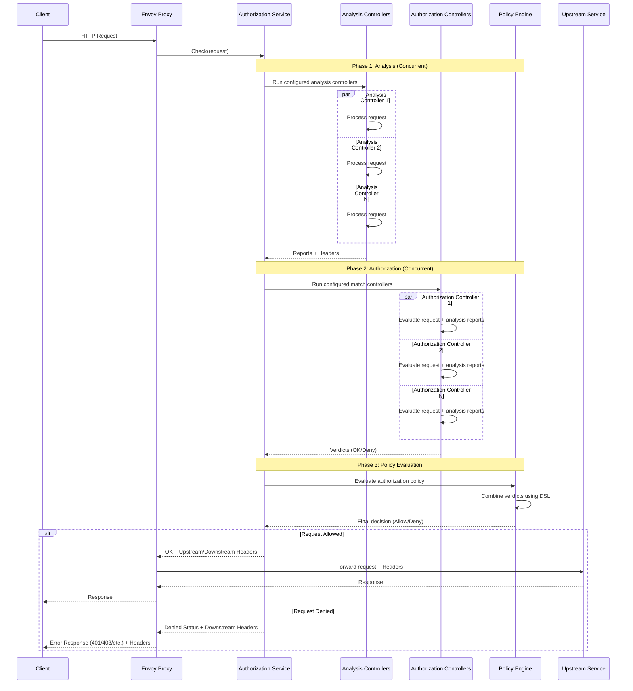

# Architecture

The Envoy Authorization Service provides a flexible, extensible framework for implementing access control policies through a three-phase pipeline.

## Request Processing Flow


```mermaid
sequenceDiagram
    participant Client
    participant Envoy as Envoy Proxy
    participant AuthService as Authorization Service
    participant Analysis as Analysis Controllers
    participant AuthZ as Authorization Controllers
    participant Policy as Policy Engine
    participant Upstream as Upstream Service

    Client->>Envoy: HTTP Request
    Envoy->>AuthService: Check(request)
    
    Note over AuthService,Policy: Phase 1: Analysis (Concurrent)
    AuthService->>Analysis: Run configured analysis controllers
    par Analysis Controller 1
        Analysis->>Analysis: Process request
    and Analysis Controller 2
        Analysis->>Analysis: Process request
    and Analysis Controller N
        Analysis->>Analysis: Process request
    end
    Analysis-->>AuthService: Reports + Headers
    
    Note over AuthService,Policy: Phase 2: Authorization (Concurrent)
    AuthService->>AuthZ: Run configured match controllers
    par Authorization Controller 1
        AuthZ->>AuthZ: Evaluate request + analysis reports
    and Authorization Controller 2
        AuthZ->>AuthZ: Evaluate request + analysis reports
    and Authorization Controller N
        AuthZ->>AuthZ: Evaluate request + analysis reports
    end
    AuthZ-->>AuthService: Verdicts (OK/Deny)
    
    Note over AuthService,Policy: Phase 3: Policy Evaluation
    AuthService->>Policy: Evaluate authorization policy
    Policy->>Policy: Combine verdicts using DSL
    Policy-->>AuthService: Final decision (Allow/Deny)
    
    alt Request Allowed
        AuthService-->>Envoy: OK + Upstream/Downstream Headers
        Envoy->>Upstream: Forward request + Headers
        Upstream-->>Envoy: Response
        Envoy-->>Client: Response
    else Request Denied
        AuthService-->>Envoy: Denied Status + Downstream Headers
        Envoy-->>Client: Error Response (401/403/etc.) + Headers
    end
```

### Phase 1: Analysis

**Purpose**: Extract and enrich request metadata without blocking the request.

**Characteristics**:
- All analysis **controllers run concurrently**
- Controllers produce **reports** and, optionally, **headers** to inject into the upstream request in case of request being allowed
- Cannot directly deny requests
- The analysis reports will be available to match controllers

**Example Analysis Controllers**:
- `maxmind-asn`: Lookup ASN from IP address
- `maxmind-geoip`: Lookup geographic location from IP
- `ua-detect`: Parse User-Agent header

**Output**:
- Analysis reports for match controllers to consume
- HTTP headers to inject into upstream requests

### Phase 2: Match

**Purpose**: Identify matches based on analysis reports, request data, configuration and possibly I/O with external datasources.

**Characteristics**:
- All match **controllers run concurrently** and they are **provided with the reports** generated in the analysis phase
- Controllers return **match verdicts**
- Each verdict has an `IsMatch` boolean flag stating how that controller should be evaluated when referenced in the authorization policy
- Can inject headers for both allowed and denied requests

**Example Match Controllers**:
- `ip-match`: Checks request IP address against configured CIDRs
- `asn-match`: Checks request ASN against configured list
- `ip-match-database`: Looks up IP address in external data sources

### Phase 3: Authorization Policy Evaluation

**Purpose**: Combine match verdicts using boolean logic to reach the final authorization decision.

**Characteristics**:
- Evaluates a boolean expression (the "authorization policy")
- References match controllers by name
- Uses each controller's `verdict.IsMatch` value as its boolean result
- Determines final allow/deny decision

**Example Policies**:
```yaml
# Allow if is corporate network OR not in blocklist
authorizationPolicy: "corporate-network || !blocklist"

# Allow only if in allowlist AND from trusted ASN
authorizationPolicy: "ip-allowlist && trusted-asn"

# Allow only if in (allowlist OR partner) AND NOT in blocklist
authorizationPolicy: "(ip-allowlist || partner-ips) && !ip-blocklist"
```

## `verdict.InPolicy` Semantics

The `verdict.InPolicy` boolean determines how a controller's verdict affects policy evaluation:

### Allow-Mode Controllers
When `action: allow`:
- `InPolicy = true` → Request matches the allowlist
- `InPolicy = false` → Request not in allowlist
- Status code is always `OK` (doesn't block)

### Deny-Mode Controllers
When `action: deny`:
- `InPolicy = true` → Request matches the denylist
- `InPolicy = false` → Request not in denylist
- Status code is `PermissionDenied` when `InPolicy = true`

### Policy Expression Behavior

Given policy: `"allowlist || !denylist"`

**Scenario 1**: IP in allowlist, not in denylist
- `allowlist.InPolicy = true`
- `denylist.InPolicy = false`
- Expression: `true || !false` = `true || true` = **ALLOW**

**Scenario 2**: IP not in allowlist, not in denylist
- `allowlist.InPolicy = false`
- `denylist.InPolicy = false`
- Expression: `false || !false` = `false || true` = **ALLOW**

**Scenario 3**: IP not in allowlist, in denylist
- `allowlist.InPolicy = false`
- `denylist.InPolicy = true`
- Expression: `false || !true` = `false || false` = **DENY**

## Header Injection

Controllers can inject headers at multiple points:

### Upstream Headers
Added to requests forwarded to upstream services:
```go
X-ASN-Number: 15169
X-GeoIP-Country: US
X-UA-Device-Type: mobile
```

### Downstream Headers
Added to responses sent back to clients:
```go
X-Blocked-Reason: IP in denylist
```

**Use Cases**:
- Pass metadata to upstream services
- Provide feedback to clients

## Error Handling

### Analysis Errors
- Logged but don't block request
- Missing reports handled by match controllers
- Metrics updated for monitoring

### Authorization Errors
- Treated according to fail-open/fail-closed setting
- Logged with full context
- Policy evaluation continues with available verdicts

### Policy Errors
- Caught at startup (validation)
- Runtime errors deny request (fail-closed)
- Detailed error messages in logs
