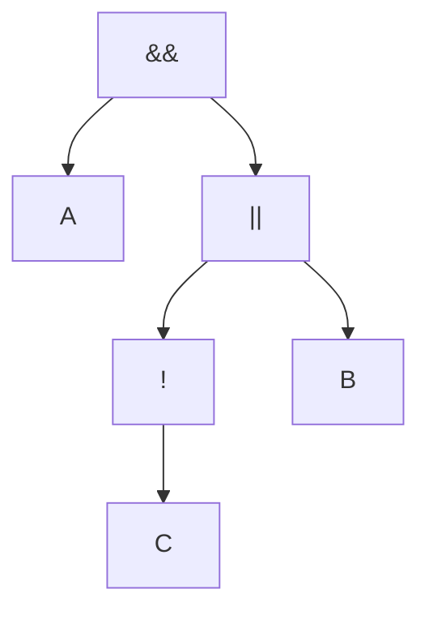

# Policy DSL

This package implements the boolean expression DSL used to compose match controller
verdicts.

A few guiding principles influenced the implementation:

- **Predictable semantics** – only the logical operators `&&`, `||`, and `!` are supported, along with parentheses for grouping
- **Controller awareness** – every identifier in the expression must map to a configured match controller. Validation occurs at parse time, producing actionable errors.
- **Deterministic evaluation** – the AST is built via a recursive descent parser so the traversal order, short-circuit behavior, and resulting culprit controller are well defined.

## Parsing

`Parse(expr string, validNames map[string]struct{})` trims the expression, rejects unknown
identifiers, and constructs an AST composed of `identifierNode`, `notNode`, and
`binaryNode`.

A `nil` policy is returned when the expression is empty, which callers treat
as an always-allow scenario.

```
A && (B || !C)
```

Parses into an AST equivalent to:



## Evaluation

`Policy.Evaluate(values map[string]bool)` walks the AST, short-circuiting whenever an
outcome is already determined.

Each node returns both a boolean value and a controller name.

For identifiers the name is the controller itself; unary/binary nodes propagate the culprit name so the manager can log which controller caused a rejection.

Negations simply invert the boolean while keeping the child’s controller name so the original verdict is still visible.
